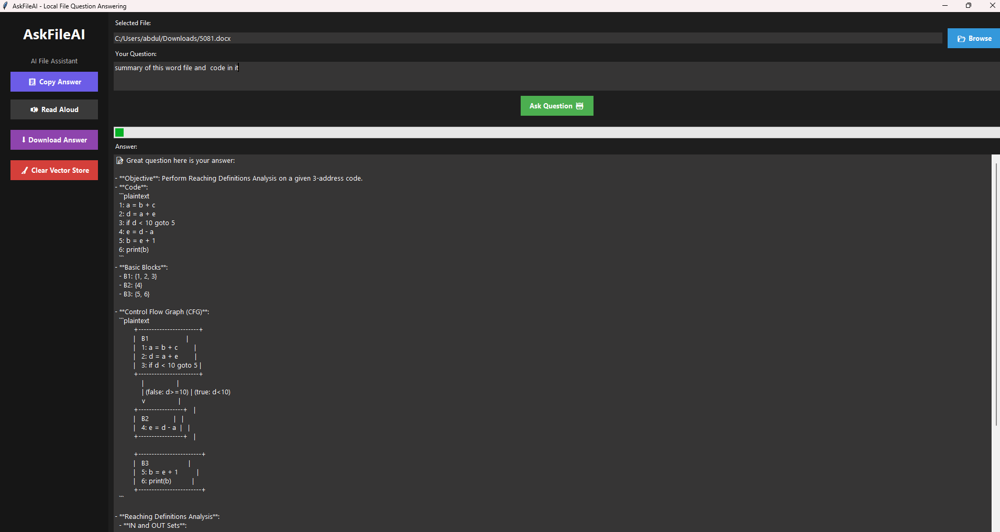

# AskFileAI 🤖

> **Local Intelligent File Question-Answering Agent**  
> Ask questions about your documents using RAG (Retrieval Augmented Generation) - completely offline and private!
>Local Intelligent File Question-Answering Agent.


[](https://www.python.org/downloads/)
[](LICENSE)
[](https://ollama.ai)

## 🌟 Features

-  100% Local & Private: All processing happens on your machine - no data sent to external APIs
-  Multi-format Support: PDF, Word, Excel, CSV, Text, Code files, and Images (OCR)
-  RAG Architecture: Retrieval Augmented Generation for accurate, context-aware answers
-  Smart Chunking: Intelligent text splitting with overlap for better context
-  Vector Search: ChromaDB-powered semantic search for relevant information
-  Conversation Context: Maintains chat history for follow-up questions
-  User-Friendly GUI: Clean Tkinter interface - no command line needed





### Running the Application

```bash
python main.py
```

### Basic Usage

1. **Select a File**: Click "Browse" and select any supported file
2. **Ask a Question**: Type your question in the text box
3. **Get Answer**: Click "Ask Question" and wait for the response

5. **Follow-up**: Ask more questions about the same file

###  Questions

**-  For a research paper:**
- "What is the main conclusion of this study?"
- "Summarize the methodology"
- "What are the key findings?"

**- For code files:**


**-   For data files (CSV/Excel):**
- "What columns are in this dataset?"
- "How many rows are there?"
- "What's the data about?"

## 📁 Project Structure

```
AskFileAI/
├── requirements.txt              # Python dependencies
├── main.py                       # Entry point (Tkinter GUI)
├── config.py                     # Configuration settings
├── src/
│   ├── file_loaders/
│   │   ├── base_loader.py       # Abstract loader class
│   │   ├── pdf_loader.py        # PDF processing
│   │   ├── docx_loader.py       # Word documents
│   │   ├── text_loader.py       # Text files
│   │   ├── csv_loader.py        # CSV files
│   │   ├── excel_loader.py      # Excel files
│   │   ├── image_loader.py      # OCR for images
│   │   └── file_loader_factory.py
│   ├── embeddings/
│   │   └── ollama_embeddings.py # Embedding generation
│   ├── vectorstore/
│   │   └── chroma_store.py      # ChromaDB vector storage
│   ├── rag/
│   │   └── chunker.py           # Text chunking logic
│   ├── agent/
│   │   ├── state.py             # LangGraph state
│   │   └── graph.py             # Agent workflow
│   └── llm/
│       └── ollama_client.py     # LLM interface
└── data/
    └── chroma_db/                # Vector database storage
```


## 📄 Supported File Types

| Type | Extensions | Notes |
|------|-----------|-------|
| PDF | `.pdf` | Full text extraction with page numbers |
| Word | `.docx`, `.doc` | Paragraphs and formatting preserved |
| Text | `.txt`, `.md` | Plain text and Markdown |
| CSV | `.csv` | Tabular data with column preview |
| Excel | `.xlsx`, `.xls` | Multiple sheets supported |
| Code | `.py`, `.cpp`, `.java`, `.js`, `.html`, `.css`, `.json`, `.xml` | Source code files |
| Images | `.png`, `.jpg`, `.jpeg`, `.bmp` | OCR text extraction (requires Tesseract) |

## 🔍 How It Works

### RAG Architecture

AskFileAI implements a Retrieval Augmented Generation (RAG) pipeline:

```
File Input → Load & Parse → Chunk Text → Generate Embeddings
                                                ↓
Answer ← LLM Generation ← Relevant Chunks ← Vector Search
```

### LangGraph Workflow

The agent uses LangGraph for orchestration:

```python
load_file → chunk_text → embed_chunks → store_vectors 
    → retrieve → generate_answer
```

Each node handles a specific task, with state passed between them.


## 📊 Performance

### Typical Processing Times

*(Intel i5 CPU, 16GB RAM)*

| Task | Time |
|------|------|
| Load 10-page PDF | ~5 seconds |
| Generate embeddings (50 chunks) | ~15 seconds |
| Retrieve + Generate answer | ~3 seconds |
| **Total (first question)** | **~23 seconds** |
| Follow-up question | ~3 seconds |

**Note:** Times vary based on hardware, model size, and document complexity.

### Performance Tips

- Cache embeddings by not clearing vector store
- Use smaller models for faster inference
- Reduce chunk count for quicker processing
- Enable GPU acceleration in Ollama

### Future Enhancements

- [ ] Streamlit web UI
- [ ] Multi-file indexing
- [ ] Table-aware Q&A
- [ ] PDF report export
- [ ] Voice input/output
- [ ] Citation highlighting
- [ ] Document comparison
- [ ] Custom prompt templates

## 📧 Contact

For questions or support:

- Open an issue on GitHub
- Email: itsar2k3@gmail.com
- LinkedIn: https://www.linkedin.com/in/abdul-rehman-b40a15214/ 


*Version 2.1.0 - 2025*