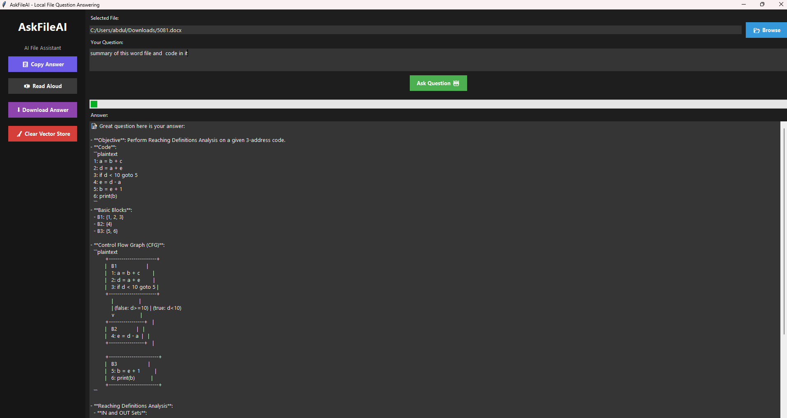

# AskFileAI 2

Local, private file Q&A using RAG (no external API required).



## Key Features

- 100% local processing with Ollama
- Supports PDF, DOCX, TXT/MD, CSV, Excel, code files, and images (OCR)
- RAG pipeline with chunking + embeddings + vector search
- LLM-based retrieval re-ranking for better answer quality
- Desktop app (Tkinter) and optional web app (Streamlit)

## What's New vs AskFileAI-v0.0.1

- Added retrieval re-ranking (`src/rag/reranker.py`)
- Updated agent flow to rerank before answer generation
- Improved Tkinter UI (dark theme + better layout)
- Added utility actions: copy answer, download answer, read aloud
- Added processing progress indicator
- Added Streamlit app (`askfileai_app.py`)

## Run

### Desktop (Tkinter)

```bash
python main.py
```

### Web (Streamlit)

```bash
streamlit run askfileai_app.py
```

## Project Structure

```text
askFileAI2/
├── main.py
├── askfileai_app.py
├── config.py
├── src/
│   ├── agent/graph.py
│   ├── rag/chunker.py
│   ├── rag/reranker.py
│   ├── vectorstore/chroma_store.py
│   ├── embeddings/ollama_embeddings.py
│   └── file_loaders/
└── ui/tkinter_app.py
```

## Supported File Types

`.pdf`, `.docx`, `.doc`, `.txt`, `.md`, `.csv`, `.xlsx`, `.xls`, `.py`, `.cpp`, `.java`, `.js`, `.png`, `.jpg`, `.jpeg`, `.bmp`

---

